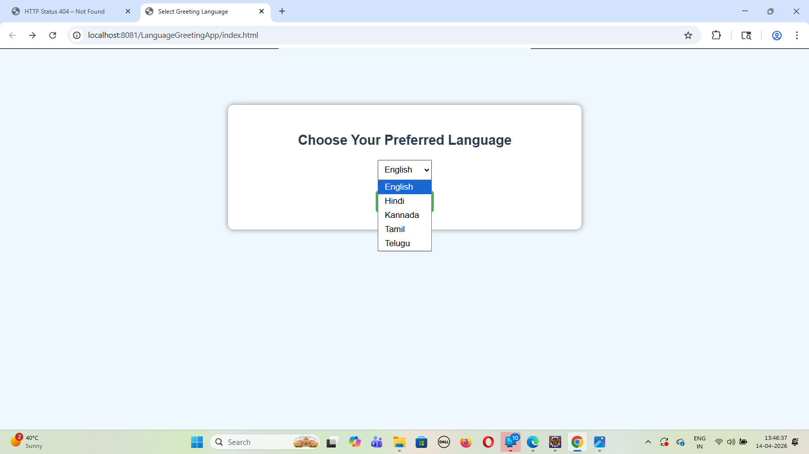
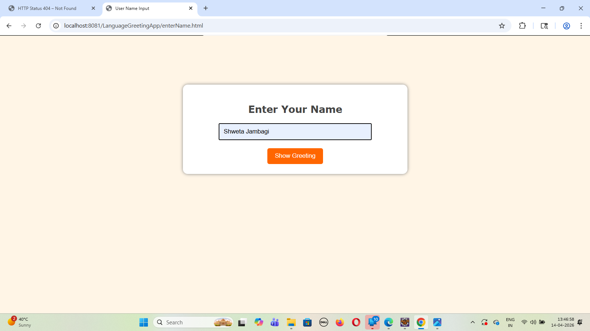
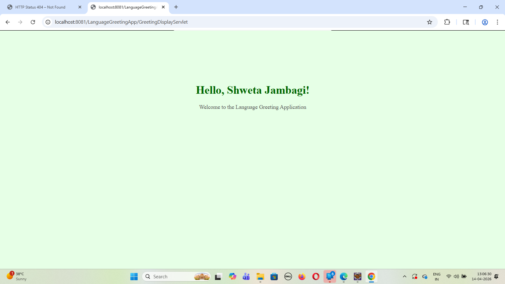
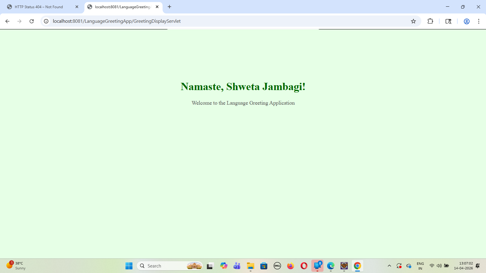
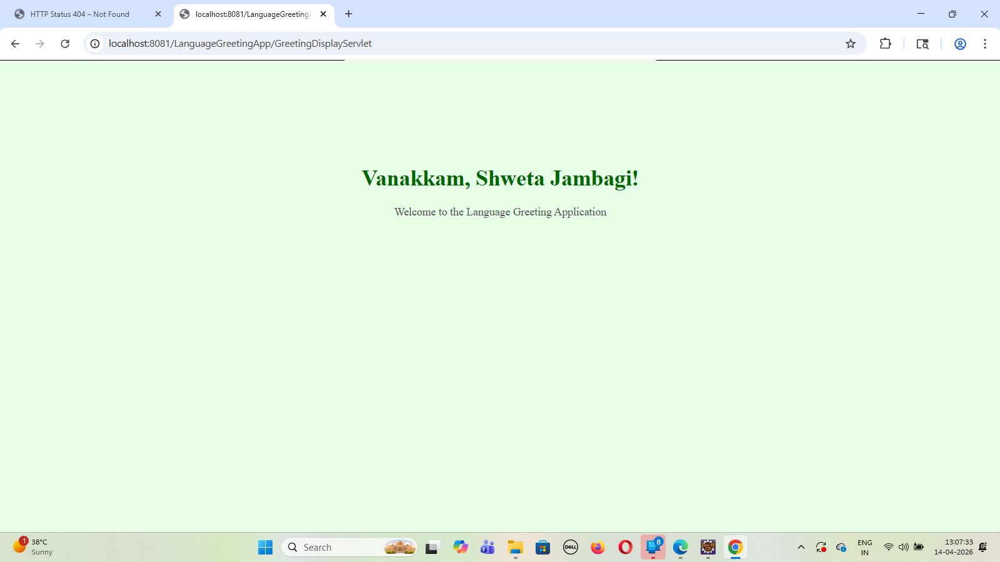
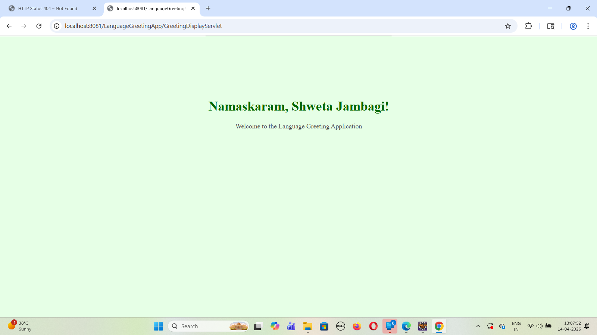

# Language-Based Greeting Web Application using HttpSession

## Student Details

| Field         | Details                          |
|--------------|----------------------------------|
| Name         | Shweta Jambagi                   |
| USN          | 2BL23CS136                       |
| Branch       | Computer Science & Engineering   |
| Semester     | VI Semester                      |
| Subject      | Advanced Java Programming        |
| Problem No.  | Problem 72                       |

---

## Problem Statement

This project is a Language-Based Greeting Web Application developed using Java Servlets and HttpSession. The user selects a preferred language (English, Hindi, Kannada, Tamil, Telugu) from a dropdown menu and enters their name. The application stores the selected language in session and displays a personalized greeting message in the chosen language.

---

## Technologies Used

- Java (Servlets)
- HTML
- Apache Tomcat Server
- Eclipse IDE

---

## How to Run This Project

1. Clone this repository or download the ZIP.
2. Import the project into Eclipse as a Dynamic Web Project.
3. Add Apache Tomcat Server in Eclipse.
4. Right-click project → Run As → Run on Server.
5. Open browser and go to:

http://localhost:8081/LanguageGreetingApp/index.html

---

## Screenshots

### Language Selection Page

### Name Input Page

### English Greeting Output

### Hindi Greeting Output

### Kannada Greeting Output

### Tamil Greeting Output

### Telugu Greeting Output

---

## Servlet Concept Practiced

This project demonstrates the use of HttpSession in Java Servlets. The selected language is stored in session using session.setAttribute(), and retrieved later to generate a personalized greeting message dynamically based on user input.
